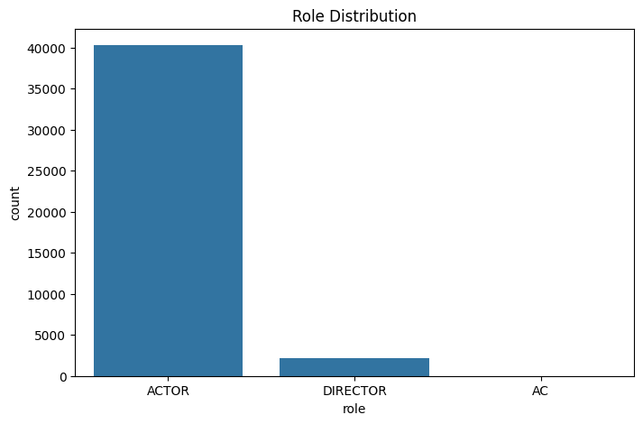
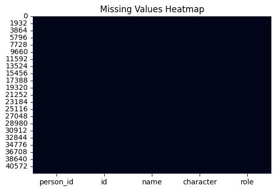
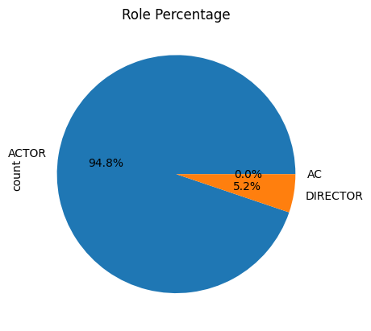
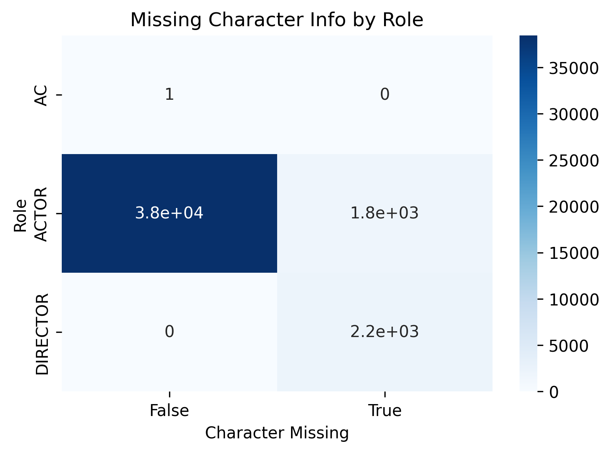

# Exploratory Data Analysis (EDA) – People & Cast Dataset

## Project Objective
The objective of this project is to perform Exploratory Data Analysis (EDA) on a people and cast dataset to understand role distribution, missing values, and patterns related to individuals and their roles in media content.
This project helped me strengthen my data cleaning, analysis, and visualization skills using Python.

## Dataset Description
The dataset contains information about people involved in movies/TV shows.

### Columns:
- `person_id` – Unique identifier for each person
- `id` – Content identifier
- `name` – Name of the person
- `character` – Character played by the person
- `role` – Role type (Actor, Director, etc.)

## Business Questions
- What roles are most common in the dataset?
- How many missing values are present and where?
- Which individuals appear multiple times?
- How is role distribution structured?
- What data quality issues exist?
- 
## Steps Performed
1. Data loading and inspection
2. Understanding columns and data types
3. Identifying missing values
4. Visualizing missing data using heatmap
5. Role-based analysis
6. Frequency analysis of people
7. Data visualization using charts

## Visualizations

### Role Distribution

### Missing Values Heatmap

### Role Percentage

## Heatmap Visualization

## Key Insights
- Majority of records belong to actors
- Large number of missing values exist in the `character` column
- Some individuals appear multiple times across different records
- Role distribution is highly imbalanced

## Skills & Tools Used
- Python
- Pandas (data manipulation)
- Matplotlib & Seaborn (visualization)
- Data Cleaning
- Exploratory Data Analysis (EDA)

## Conclusion
This mini project provided hands-on experience in real-world data analysis, especially in handling missing values and extracting insights from raw data.
